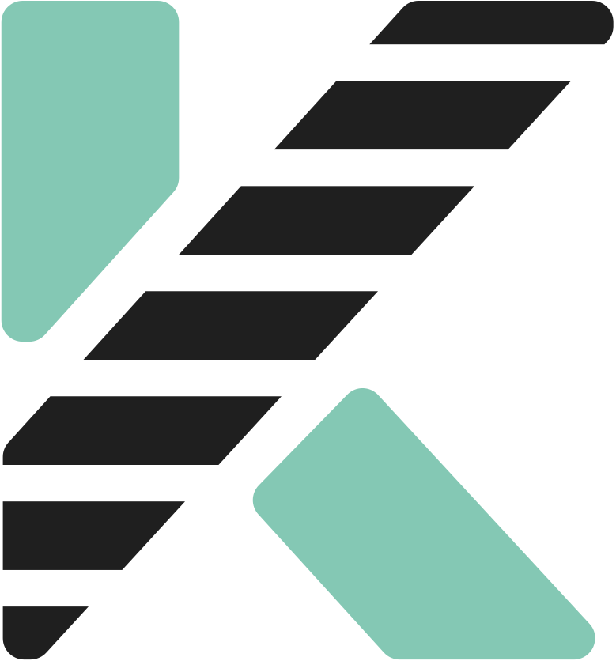

 KADAI - The open source task management library
=================================================

KADAI is a task management component open source library. It can be embedded into your application
or be operated standalone if appropriate. Beside the basic task management functionalities,
KADAI adds workbaskets and classifications to control and monitor a large amount of Tasks within
a larger organization.

* Web Site: http://kadai.io/
* Demo Environment: https://kadai-io.azurewebsites.net/kadai
* Issue Tracker: https://github.com/kadai-io/kadai/issues
* License: Apache License, Version 2.0  https://www.apache.org/licenses/LICENSE-2.0

---
_We're not aware of all installations of our Open Source project. However, we love_

* _listening to your feedback,_
* _discussing possible use cases with you,_
* _aligning the roadmap to your needs!_

📨 _Feel free to [contact](#contact) us if you need consulting support._

---

# Table of Contents

* ✨ [Overview](#Overview)
    * [Tasks](#Tasks)
    * [Workbasket](#workbasket)
    * [Classification](#classification)
    * [Routing](#routing)
    * [Prioritization](#prioritization)
* 🧫 [Components](#components)
    * [KADAI Lib](#Kadai-lib)
    * [KADAI REST API](#Kadai-rest-api)
    * [KADAI workplace](#Kadai-workplace)
    * [KADAI admin](#Kadai-admin)
    * [KADAI monitor](#Kadai-monitor)
* 🚀 [Getting Started](#getting-started)
    * [Requirements](#requirements)
    * [Spring Boot Example](#spring-boot-example)
* ⚙️ [Customize Behaviour](#customize-behaviour)
* 📚 [Releases](#releases)
* 🖼️ [Demo](#demo)
* 📨 [Contact](#contact)

# ✨Overview

## TASKS

Tasks are the main entity of KADAI. Each Task has its describing attributes like priority and due
date.

Furthermore each Task has a state.

And a Task holds a reference to the system and business object, it is associated with. This is
important since is meant to be a standalone component.

All Tasks are placed in a Workbasket to control and direct the handling of the Tasks.

## WORKBASKETS

Workbaskets are the main structure to distribute the Tasks to the available users. There are
personal, group/team and topic Workbaskets.

Workbaskets indicate the responsibility for a Task. The concepts of Workbaskets allow to
differentiate between the permissions or the skills required to complete specific Tasks and the
determination who should complete certain Tasks. This can diverge a lot in a larger organization.

  

## CLASSIFICATIONS

Classifications allow to identify the type of a Task. The Task derives some major attributes from
the Classification, such as the service level and the priority.

Classifications can be configured by a responsible business administrator to control the handling
of the Tasks.

## Routing

Kadai offers various routing and distribution functions to assign incoming Tasks to the correct
Workbaskets, or to redistribute them between Workbaskets.

## Prioritization

Dynamic prioritization functions allow you to control the processing sequence of
Tasks at any time. This ensures that the most important Tasks are always addressed first.

  

# 🧫Components

  

It splits up into five components:

* KADAI Lib
    * The Java library providing the Task management functions
* KADAI REST API
    * REST API to allow remote access to the KADAI system.
* KADAI workplace
    * Angular based web application to work on the Tasks
    * Sample Tasklist application you can use if appropriate
* KADAI admin
    * Angular based web application to configure the system
    * Supports Workbaskets and Classifications
* KADAI monitor
    * Angular based web application to monitor the status of the entire Task pool
    * Provides views and statistics about the conformance with defined services levels
    * Shows the workload of your organization and the individual teams

# 🚀Getting Started

As KADAI is meant to be integrated in the development environment and process of your organisation, you have to create
your own small integration project as a wrapper and starting point for your customisations.

We currently provide examples how to run KADAI as a Spring Boot Application.

If you are only interested in how KADAI looks and feel, you can try our [Demo Environment](#demo) instead.

## Requirements

Runtime Environment at least Java 17

Supported Databases:

* H2 (We test with 2.1.214*)
* Postgres (We test with 14.7*)
* DB2 (We test with 11.5.6*)

_* other versions of the named databases should work also, but haven't been tested_

## Spring Boot Example

We use the h2 database in this example.

See `rest/kadai-rest-spring-example-boot` and it dependencies

# ⚙️Customize Behaviour

KADAI allows to customize and modify it’s behaviour through the use of dedicated Service
Provider Interfaces (SPI). Each SPI defines an interface that can be implemented by custom code.
This is a common approach for Java developers to extend their applications. You can find out more
about the background and the details in the Java documentation:
https://docs.oracle.com/javase/tutorial/sound/SPI-intro.html

In order to use an SPI within KADAI, you must

* create a class that implements the relevant interface.
* place that class into the classpath of your application
* provide a control file with full name of the SPI
  (e. g. io.kadai.spi.task.api.CreateTaskPreprocessor) in the subdirectory META-INF/services of
  the classpath. This control file must contain the fully qualified classname (including the
  package) of the class that implements the relevant interface. This control file is used by the
  ServiceLoader to load the custom class at runtime. The control file may contain multiple classes
  has implement the interface. Each implementation should be declared in a new line.

  All implementations will be used consecutively in the declaration order of the control file.

If you provide one or multiple implementations according to the description above, KADAI will invoke the implementations
at a specific point. The Javadoc of each SPI describes the conditions for the implementation to be executed.

Currently, KADAI provides the following SPIs:

* [`io.kadai.spi.history.api.KadaiHistory`](https://github.com/kadai-io/kadai/blob/master/lib/kadai-core/src/main/java/io/kadai/spi/history/api/KadaiHistory.java)
* [`io.kadai.spi.priority.api.PriorityServiceProvider`](https://github.com/kadai-io/kadai/blob/master/lib/kadai-core/src/main/java/io/kadai/spi/priority/api/PriorityServiceProvider.java)
* [`io.kadai.spi.routing.api.TaskRoutingProvider`](https://github.com/kadai-io/kadai/blob/master/lib/kadai-core/src/main/java/io/kadai/spi/routing/api/TaskRoutingProvider.java)
* [`io.kadai.spi.task.api.AfterRequestChangesProvider`](https://github.com/kadai-io/kadai/blob/master/lib/kadai-core/src/main/java/io/kadai/spi/task/api/AfterRequestChangesProvider.java)
* [`io.kadai.spi.task.api.AfterRequestReviewProvider`](https://github.com/kadai-io/kadai/blob/master/lib/kadai-core/src/main/java/io/kadai/spi/task/api/AfterRequestReviewProvider.java)
* [`io.kadai.spi.task.api.BeforeRequestChangesProvider`](https://github.com/kadai-io/kadai/blob/master/lib/kadai-core/src/main/java/io/kadai/spi/task/api/BeforeRequestChangesProvider.java)
* [`io.kadai.spi.task.api.BeforeRequestReviewProvider`](https://github.com/kadai-io/kadai/blob/master/lib/kadai-core/src/main/java/io/kadai/spi/task/api/BeforeRequestReviewProvider.java)
* [`io.kadai.spi.task.api.CreateTaskPreprocessor`](https://github.com/kadai-io/kadai/blob/master/lib/kadai-core/src/main/java/io/kadai/spi/task/api/CreateTaskPreprocessor.java)
* [`io.kadai.spi.task.api.ReviewRequiredProvider`](https://github.com/kadai-io/kadai/blob/master/lib/kadai-core/src/main/java/io/kadai/spi/task/api/ReviewRequiredProvider.java)
* [`io.kadai.spi.user.api.RefreshUserPostprocessor`](https://github.com/kadai-io/kadai/blob/master/lib/kadai-core/src/main/java/io/kadai/spi/user/api/RefreshUserPostprocessor.java)

# 📚Releases

The list of [releases](https://github.com/kadai-io/kadai/releases) contains a detailed changelog.

We use [Semantic Versioning](https://semver.org/).

# 🖼️Demo

Our focus is mainly directed to the backend, but we maintain a demo frontend in Angular, check it out by clicking on the badge!

For login choose username `teamlead-1` with password `teamlead-1`.

# 🌱 Sustainability

[KADAI](https://www.blauer-engel.de/de/produkte/kadai-open-source-software-for-task-management) successfully underwent [certification](docs/Urkunde-Blauer-Engel-KADAI.pdf) for the [*Blauer Engel for Software*](https://www.blauer-engel.de/en/productworld/software), an eco-label for resource- and energy-efficient software products awarded by the [German Environment Agency (Umweltbundesamt)](https://www.umweltbundesamt.de/en). 
A central part of the certification is the definition of a standard usage scenario, which reflects typical user interactions.

In our defined scenario, the following activities were performed:

* Create a new task
* Search for workbaskets with a specific permission (OPEN)
* Open a workbasket 
* Retrieve the first 50 tasks from a workbasket
* Read a single task
* Edit a task
* Transfer a task to another workbasket
* Claim a task  
* Retrieve comments for a task
* Add a new comment to a task
* Delete a comment
* Complete a task
* Search for additional tasks with the same object reference

Additionally, a single user performed the following activity:
* Retrieve the task status report (monitoring)

These badges show the energy cost for this scenario (done by 100 virtual users): 

 

The full procedure for the measurement can be found [here](docs/Messungen-Blauer-Engel-KADAI.pdf).

# 📨Contact

If you have any questions or ideas feel free to create an [issue](https://github.com/kadai-io/kadai/issues),
contact us via [GitHub Discussions](https://github.com/kadai-io/kadai/discussions)
or E-mail us at [kadai@envite.de](mailto:kadai@envite.de).

We love listening to your feedback, and of course also discussing the project roadmap and possible use cases with you!

This open source project is being developed by [envite consulting GmbH](https://www.envite.de/) 
with the support of the open source community.

---

---

                       
